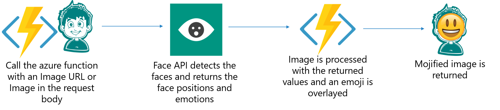

# Mojifier-csharp : Overlay emojis on faces based on the emotion detected using Microsoft Cognitive Services and Azure Functions

### Hey there! :wave:

This project was an inspiration from one of the [courses at Microsoft Learn for making a Mojifier slackbot](https://docs.microsoft.com/en-us/learn/modules/replace-faces-with-emojis-matching-emotion/?WT.mc_id=mojiifierweb-mojifier-ashussai) but using Typescript. 

This project has been completely rewritten in C# and using different libraries and methods.

### What is it exactly? :question::thinking:

We are leveraging the power of serverless computing and AI to detect faces and their emotions from a picture and overlaying appropriate emojis on them. We use Face API from Microsoft Cognitive Services to detect faces and their emotions in a picture and then the Azure Function processes the image, adds an overlay and returns the Mojified image. The flow is as shown below:

### What tools do you need to run it? :hammer_and_wrench:

1. Visual Studio 2019 (if you are using Visual Studio 2017, you need to install the [Azure Functions Extension](https://marketplace.visualstudio.com/items?itemName=VisualStudioWebandAzureTools.AzureFunctionsandWebJobsTools)) or Visual Studio Code with Azure Functions Extension
2. [Azure Subscription](https://azure.microsoft.com/en-us/)
3. [Face API](https://azure.microsoft.com/en-us/services/cognitive-services/face/) resource in Azure
4. Storage Account resource in Azure (included in Azure function app on Azure)

### How do you run it? :runner:

1. Open the local.settings.json file in the mojifier solution and replace the  <YOUR_API_URL> with your Face API URL and  <YOUR_FACE_API_KEY> with your Face API Key
2. Add a container in the storage account and add the images under Emoji_images folder in the repository
3. Open one of the images in the container and copy the image URL and replace it with  <YOUR_STORAGE_ACCOUNT_URL> without the image name and extension
4. Run the solution

And finally, many thanks to the authors and contributors of [ImageSharp](https://github.com/SixLabors/ImageSharp) for developing an amazing nuget package for processing the image and overlaying the emoji on the picture. :tada:

Feel free to raise an issue in case you face anything and would love to improve it with collaboration and contribution. 

Happy coding and Happy Mojifying! :happy: 
